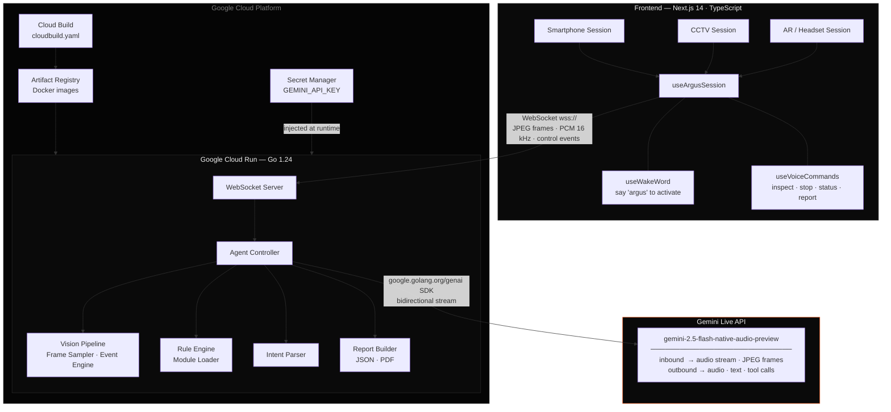

# ARGUS

> *Speak to it. Point a camera at it. It tells you what's dangerous.*

ARGUS is a real-time AI safety inspection platform built on the Gemini Live API. It maintains a persistent bidirectional stream of audio and video, reasons about the environment against swappable inspection rule sets, annotates hazards with AR overlays, and speaks findings back to the operator — all with sub-second latency and native interruption support.

Built for the **Gemini Live Agent Challenge** · Category: **Live Agents**

---

## The Problem

Safety inspections are slow, manual, and reactive. An inspector walks a site, documents what they see, and produces a report hours later. By then, the window to prevent an incident has closed.

ARGUS makes inspection continuous, conversational, and immediate. Point any camera — a phone, a fixed CCTV feed, an AR headset — and the agent begins watching, reasoning, and reporting in real time. It adapts its detection rules to the environment it's in, speaks hazard alerts aloud, and can be directed entirely by voice.

---

## Capabilities

| Feature | Detail |
|---|---|
| Real-time hazard detection | JPEG frames streamed to Gemini Live at up to 2 fps |
| Bidirectional voice | Raw PCM audio streamed in both directions; Gemini responds in speech |
| Interruption handling | Mid-response user speech immediately cancels the current output |
| Wake word activation | Say **"argus"** to start or stop an inspection hands-free |
| AR hazard overlays | Severity-coloured rings rendered over the live camera feed |
| Swappable rule modules | Construction, warehouse, electrical, facility — hot-switchable mid-session |
| Voice commands | `inspect` · `stop` · `status` · `report` |
| Report generation | Full inspection reports exported as JSON or PDF |
| Adaptive interface | Auto-detects context and renders the right UI: Smartphone / CCTV / AR |

---

## Interface Modes

ARGUS detects the device and environment on load and renders one of three purpose-built interfaces — no configuration required.

**Smartphone** — Full-screen camera viewfinder with a pull-up hazard sheet. Designed for fieldwork and handheld inspection.

**CCTV** — Multi-feed 2×2 grid with a sidebar showing risk level, hazard log, mode selector, and keyboard shortcuts. Designed for fixed monitoring stations.

**AR / Headset** — Minimal corner HUD with hazard count and connection state. Ring overlays drawn directly over the camera feed. Voice-first; the inspect button appears only when voice is disabled.

---

## Architecture



---

## Tech Stack

**Backend**
- Go 1.24
- `google.golang.org/genai` — official Google GenAI SDK
- Gemini Live API — `gemini-2.5-flash-native-audio-preview` (bidirectional stream)
- Gemini GenerateContent — `gemini-2.5-flash` (one-shot frame analysis fallback)
- Gorilla WebSocket

**Frontend**
- Next.js 14, TypeScript, Tailwind CSS
- Web Speech API — always-on wake word detection + voice commands
- Web Audio API — PCM audio capture and streaming
- WebXR — AR session detection
- Space Grotesk · Figtree · IBM Plex Mono

**Google Cloud**
- Cloud Run — backend hosting with WebSocket session affinity
- Cloud Build — automated container builds (`cloudbuild.yaml`)
- Artifact Registry — Docker image registry
- Secret Manager — secure API key storage

---

## Getting Started

### Prerequisites

- Go 1.24+
- Node.js 18+
- A Gemini API key — [get one at Google AI Studio](https://aistudio.google.com/app/apikey)

### Run locally

```bash
# 1. Clone and configure
git clone https://github.com/cutmob/argus
cd argus
cp .env.example .env
# Set GEMINI_API_KEY in .env

# 2. Backend
make run
# → http://localhost:8080
# → health: http://localhost:8080/api/v1/health

# 3. Frontend (separate terminal)
make frontend-install
make frontend-dev
# → http://localhost:3001
```

---

## Cloud Deployment

### Prerequisites

- [gcloud CLI](https://cloud.google.com/sdk/docs/install) installed and authenticated (`gcloud auth login`)
- A GCP project with billing enabled

### Deploy

```bash
make deploy PROJECT=your-gcp-project-id
```

The script handles everything end to end:

1. Enables Cloud Run, Cloud Build, Artifact Registry, and Secret Manager APIs
2. Creates the Artifact Registry repository
3. Prompts for your Gemini API key and stores it in Secret Manager — never written to disk or config files
4. Builds the Go container via Cloud Build — no Docker installation required locally
5. Deploys to Cloud Run with WebSocket session affinity and a 1-hour connection timeout
6. Outputs the live service URL

Once deployed, point the frontend at the backend:

```bash
# In frontend/web-client/.env.local
NEXT_PUBLIC_WS_URL=wss://your-service-url.run.app/ws
```

### CI/CD pipeline

```bash
# Submit a build manually via Cloud Build
make deploy-cloudbuild PROJECT=your-gcp-project-id

# Or connect the repository to a Cloud Build trigger in GCP Console
# — subsequent pushes to main will build and deploy automatically via cloudbuild.yaml
```

### View logs

```bash
make logs PROJECT=your-gcp-project-id
```

---

## Inspection Modules

Modules live in `./modules/`. Each is a self-contained directory:

| File | Purpose |
|---|---|
| `metadata.json` | Name, version, author, tags |
| `rules.json` | Hazard detection rules with severity levels |
| `prompt.txt` | System prompt injected into the Gemini Live session on start |

**Built-in:** `construction` · `elevator` · `facility`

To add a module:

```bash
make new-module NAME=warehouse
# Then edit modules/warehouse/rules.json and modules/warehouse/prompt.txt
```

Modules can be switched mid-session — the agent context updates immediately.

---

## WebSocket Protocol

All real-time communication between the frontend and backend runs over a single WebSocket connection at `/ws`.

**Client → Server**

```json
{ "type": "frame",  "data": "<base64 JPEG>" }
{ "type": "audio",  "data": "<base64 PCM, 16kHz mono, 16-bit LE>" }
{ "type": "event",  "event": "start_inspection", "mode": "construction" }
{ "type": "event",  "event": "stop_inspection" }
{ "type": "event",  "event": "generate_report",  "format": "pdf" }
```

**Server → Client**

```json
{ "type": "hazard",        "hazards": [...],  "overlays": [...] }
{ "type": "voice_response","text": "...",     "audio": "<base64 PCM>" }
{ "type": "overlay",       "overlays": [...] }
{ "type": "report",        "report": {...} }
{ "type": "error",         "message": "..." }
```

---

## REST API

| Method | Endpoint | Description |
|---|---|---|
| `GET` | `/api/v1/health` | Health check |
| `GET` | `/api/v1/sessions` | List active sessions |
| `GET` | `/api/v1/sessions/:id` | Session details and hazard log |
| `GET` | `/api/v1/modules` | List available inspection modules |
| `POST` | `/api/v1/reports` | Generate a report for a session |
| `GET` | `/api/v1/reports/:id` | Retrieve a generated report |

---

## Environment Variables

| Variable | Required | Default | Description |
|---|---|---|---|
| `GEMINI_API_KEY` | Yes | — | Google Gemini API key |
| `PORT` | No | `8080` | HTTP listen port |
| `ARGUS_MODULES_DIR` | No | `./modules` | Path to inspection modules directory |
| `GEMINI_LIVE_MODEL` | No | `gemini-2.5-flash-native-audio-preview` | Override Live API model |
| `GEMINI_CONTENT_MODEL` | No | `gemini-2.5-flash` | Override GenerateContent model |

---

## Makefile Reference

| Target | Description |
|---|---|
| `make run` | Run backend locally |
| `make frontend-dev` | Run frontend dev server |
| `make build` | Compile Go binary |
| `make test` | Run Go tests |
| `make docker-build` | Build Docker image locally |
| `make deploy PROJECT=…` | Full Cloud Run deployment |
| `make deploy-cloudbuild PROJECT=…` | Trigger Cloud Build manually |
| `make logs PROJECT=…` | Stream Cloud Run logs |
| `make new-module NAME=…` | Scaffold a new inspection module |

---

## License

AGPL-3.0 with a commercial licensing option — see [LICENSE](LICENSE).
