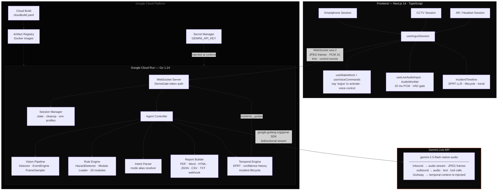

# ARGUS

ARGUS is a real-time AI safety inspection platform built on the Gemini Live API. It maintains a persistent bidirectional stream of audio and video, reasons about the environment against swappable inspection rule sets, annotates hazards with AR overlays, and speaks findings back to the operator — all with sub-second latency and native interruption support.

Built for the **Gemini Live Agent Challenge** · Category: **Live Agents**

---

## How It Works

1. Open ARGUS on any device — phone, desktop, or AR headset. The interface auto-configures for your environment.
2. Select an inspection module (or let ARGUS detect the context automatically).
3. Say **"argus"** or tap **Inspect** to begin. ARGUS opens a persistent bidirectional stream to Gemini Live.
4. Point the camera. ARGUS streams frames and audio continuously, reasoning against the active rule set in real time.
5. Hazards are announced aloud, annotated on screen, and logged to the session. Ask questions, redirect the camera, switch modes — all by voice.
6. Say **"report"** when done. ARGUS generates a structured inspection report with every finding, timestamp, camera ID, and spatial location.

---

## Use Cases

**1. Pre-shift construction site walkthrough**
A site supervisor puts on AR glasses and walks the perimeter before crews arrive. ARGUS watches through the camera, calls out a missing fall-arrest anchor on scaffold level 3, flags an unsecured load on the materials hoist, and logs both with timestamps. The supervisor never stops walking or touches a screen.

**2. Fleet pre-trip inspection**
A truck driver holds up their phone and slowly pans around the vehicle. ARGUS checks tire sidewalls, brake hoses, glad-hand seals, USDOT markings, and the CVSA decal — 45 rules in seconds. It speaks "left rear tire sidewall shows a visible bulge, critical severity" and flags it in the report before the driver reaches the cab door.

**3. Hospital compliance monitoring via fixed CCTV**
A facilities team connects three corridor cameras to the CCTV interface. ARGUS monitors all feeds simultaneously, alerting when a fire door is propped open, when a crash cart is blocking an egress path, or when a medical gas cylinder is unsecured — without any human watching the screens.

**4. Restaurant kitchen health inspection**
An environmental health officer opens ARGUS on their phone, selects the `kitchen` module, and walks the line. ARGUS flags a sanitiser bucket below required concentration, a cutting board stored above raw meat, and a missing date label on a prep container — each with the applicable FDA Food Code citation spoken aloud and captured in the report.

**5. School security sweep**
A resource officer does a morning walkthrough with the `school` module active. ARGUS watches for unattended bags near exits, propped exterior doors, unsecured equipment that could serve as a blunt weapon, and any object matching firearm profile — flagging anomalies immediately and logging location and timestamp for the incident record.

---

## The Problem

Safety inspections are slow, manual, and reactive. An inspector walks a site, documents what they see, and produces a report hours later. By then, the window to prevent an incident has closed.

ARGUS makes inspection continuous, conversational, and immediate. Point any camera — a phone, a fixed CCTV feed, an AR headset — and the agent begins watching, reasoning, and reporting in real time. It adapts its detection rules to the environment it's in, speaks hazard alerts aloud, and can be directed entirely by voice.

---

## Capabilities

| Feature | Detail |
|---|---|
| Real-time hazard detection | JPEG frames streamed to Gemini Live at 1 fps |
| Bidirectional voice | Raw PCM audio via AudioWorklet at 20 ms chunks (16 kHz); Gemini responds in speech |
| Interruption handling | Mid-response user speech immediately cancels the current output |
| Wake word activation | Say **"argus"** to start an inspection hands-free |
| Glassmorphic AR overlays | Dark or light liquid-glass overlays with severity-coded corner brackets |
| Swappable rule modules | 20 industry-specific inspection rule sets — hot-switchable mid-session |
| Voice commands | See full command reference below |
| Report generation | Full inspection reports exported as PDF, Word, JSON, CSV, HTML, or webhook |
| Adaptive interface | Auto-detects context and renders the right UI: Smartphone / CCTV / AR |
| **Temporal reasoning** | SPRT log-likelihood accumulator tracks hazard evidence over time; incidents auto-confirm at LLR ≥ 2.89 and auto-resolve at LLR ≤ −2.25 |
| **Incident lifecycle** | Six states: detected → persistent → escalated → acknowledged → resolved → recurring |
| **Risk trend analysis** | Sliding 20-sample confidence history; slope direction computed as escalating / stable / improving |
| **Incident Timeline panel** | Glass-morphic overlay listing active incidents with SPRT LLR bar, lifecycle badge, trend, duration, cameras, and triggered rules |
| **Session continuity** | GoAway reconnect injects active incident context into the new Gemini Live session so reasoning resumes without loss |

---

## Voice Commands

ARGUS is designed to be fully voice-controlled. All commands work in AR and Smartphone modes.

### Wake word

| Phrase | Action |
|---|---|
| **"argus"** | Start inspection (only activates — never stops) |

The wake word activates ARGUS. If the word "stop", "end", "cancel", "abort", or "halt" appears in the same utterance, activation is suppressed so follow-on commands are handled cleanly.

Commands are matched loosely — partial phrases work. "stop", "end", "end inspection", "please stop" all stop an inspection.

### Inspection control

| Phrase | Action |
|---|---|
| "inspect" / "start" | Start inspection |
| "stop" / "end" | Stop inspection |
| "report" | Generate inspection report |
| "status" / "how many" / "what's the…" | Speak hazard count and current risk level |
| "describe" / "what do you see" / "summary" / "analyse" / "look" | Speak a summary of current detected hazards |

### Clear / reset

| Phrase | Action |
|---|---|
| "clear" / "reset" / "clear log" / "reset log" / "clear hazards" / "wipe" / "start fresh" | Clear all detected hazards and reset risk level |

### Mode switching (AR only)

| Phrase | Action |
|---|---|
| "switch to electrical" / "change to kitchen" / "elevator mode" / "elevator" | Switch inspection module mid-session |

Any module name works: `construction` · `facility` · `warehouse` · `manufacturing` · `electrical` · `kitchen` · `healthcare` · `refinery` · `laboratory` · `office` · `retail` · `hotel` · `school` · `datacenter` · `parking` · `elevator` · `loading dock` · `cold storage` · `rooftop` · `fleet`

### Overlays

| Phrase | Action |
|---|---|
| "overlay" / "show" / "hide" | Toggle hazard overlays on/off |
| "light" / "bright" | Switch to light liquid-glass overlay style |
| "dark" | Switch to dark liquid-glass overlay style |

### Voice / mute

| Phrase | Action |
|---|---|
| "mute" | Silence all spoken responses |
| "unmute" / "sound on" / "voice on" | Re-enable spoken responses |

### CCTV keyboard shortcuts

| Key | Action |
|---|---|
| `O` | Toggle overlays |

### Smartphone

The pull-up sheet at the bottom of the screen has a `◑` / `○` button to toggle between dark and light glass overlay styles.

---

## Interface Modes

ARGUS detects the device and environment on load and renders one of three purpose-built interfaces — no configuration required.

**Smartphone** — Full-screen camera viewfinder with a pull-up hazard sheet (mode selector, inspect/stop/report actions, hazard log, glass style toggle). Designed for fieldwork and handheld inspection.

**CCTV** — Multi-feed 2×2 grid with a sidebar showing risk level, hazard log, mode selector, and keyboard shortcuts. Designed for fixed monitoring stations.

**AR / Headset** — Near-invisible UI. A tiny indicator in the top-left corner shows state: spinning arc while processing, audio bars while speaking, a context label ("watching", "scanning", "N flagged") while active, nothing while idle. No dashboard, no buttons. Everything is voice-controlled — the display is pure camera passthrough.

---

## Temporal Reasoning

ARGUS goes beyond per-frame hazard detection. A backend temporal engine tracks each hazard type over time using **Wald's Sequential Probability Ratio Test (SPRT)**, giving every incident a mathematically grounded confirmation before escalating.

### How it works

Each time a hazard is detected, its confidence score contributes an observation to a running **log-likelihood ratio (LLR)**:

```
LLR += log(confidence / (1 - confidence))
```

| LLR threshold | Meaning |
|---|---|
| ≥ **2.89** (α=0.05, β=0.10) | SPRT alarm — incident confirmed |
| ≤ **−2.25** | SPRT clear — incident auto-resolved |

A sliding 20-sample **confidence history** feeds a slope computation that labels the incident's **risk trend**: `escalating` · `stable` · `improving`.

### Incident lifecycle

```
detected → persistent → escalated → acknowledged → resolved → recurring
```

Incidents progress through these states automatically as evidence accumulates. Each incident tracks: duration, peak LLR, triggered rules, contributing cameras, frame snapshots, and trend direction.

### Session continuity

When Gemini sends a `GoAway` (planned reconnect), ARGUS serialises all active incidents and injects them as context into the new Live session — the agent's temporal awareness survives the reconnect without any gap.

### Frontend panel

The **Incident Timeline** panel (bottom overlay, all session modes) shows:
- Severity dot + lifecycle badge + hazard type + trend icon + duration
- SPRT LLR progress bar (grey → amber → green at confirmation threshold)
- Expandable detail: timestamps, peak LLR, cameras, rules triggered, snapshot count

---

## Architecture



---

## Tech Stack

**Backend**
- Go 1.24
- `google.golang.org/genai` — official Google GenAI SDK
- Gemini Live API — `gemini-2.5-flash-native-audio-preview` (bidirectional stream)
- Gemini GenerateContent — `gemini-2.5-flash` (one-shot frame analysis fallback)
- Gorilla WebSocket

**Frontend**
- Next.js 14, TypeScript, Tailwind CSS
- Web Speech API — always-on wake word detection + voice commands
- **AudioWorklet** — dedicated-thread PCM capture at 20 ms / 320-sample chunks with VAD energy gate (replaces ScriptProcessorNode)
- WebXR — AR session detection
- Space Grotesk · Figtree · IBM Plex Mono

**Google Cloud**
- Cloud Run — backend hosting with WebSocket session affinity
- Cloud Build — automated container builds (`cloudbuild.yaml`)
- Artifact Registry — Docker image registry
- Secret Manager — secure API key storage

---

## Quick Start

> **You need three things installed:** [Go 1.24+](https://go.dev/dl/), [Node.js 18+](https://nodejs.org/), and a [Gemini API key](https://aistudio.google.com/app/apikey).

```bash
git clone https://github.com/cutmob/ARgus
cd ARgus
copy .env.example .env        # (macOS/Linux: cp .env.example .env)
# Open .env and paste your GEMINI_API_KEY
npm start                      # installs deps, starts backend + frontend
```

That's it. Open **http://localhost:3000/session** and enter the demo token **`ARGUS-DEMO1`**.

`npm start` works on **Windows (PowerShell / CMD)**, **macOS**, and **Linux** — no bash, no Make, no Docker required. It auto-installs frontend dependencies on first run, creates config files, waits for the backend to be ready, and prints the URL when everything is up.

### Alternative: bash / Make (macOS / Linux / Git Bash)

```bash
bash dev.sh                   # same thing, bash version
# or
make dev                      # calls dev.sh
make dev-backend              # backend only
make dev-frontend             # frontend only
```

---

## Cloud Deployment

### Prerequisites

- [gcloud CLI](https://cloud.google.com/sdk/docs/install) installed and authenticated (`gcloud auth login`)
- A GCP project with billing enabled

### Deploy

```bash
make deploy PROJECT=your-gcp-project-id
```

The script handles everything end to end:

1. Enables Cloud Run, Cloud Build, Artifact Registry, and Secret Manager APIs
2. Creates the Artifact Registry repository
3. Prompts for your Gemini API key and stores it in Secret Manager — never written to disk or config files
4. Builds the Go container via Cloud Build — no Docker installation required locally
5. Deploys to Cloud Run with WebSocket session affinity and a 1-hour connection timeout
6. Outputs the live service URL

Once deployed, point the frontend at the backend:

```bash
# In frontend/web-client/.env.local
NEXT_PUBLIC_WS_URL=wss://your-service-url.run.app/ws
```

### CI/CD pipeline

```bash
# Submit a build manually via Cloud Build
make deploy-cloudbuild PROJECT=your-gcp-project-id

# Or connect the repository to a Cloud Build trigger in GCP Console
# — subsequent pushes to main will build and deploy automatically via cloudbuild.yaml
```

### View logs

```bash
make logs PROJECT=your-gcp-project-id
```

---

## Inspection Modules

Modules live in `./modules/`. Each is a self-contained directory:

| File | Purpose |
|---|---|
| `metadata.json` | Name, version, author, tags |
| `rules.json` | Hazard detection rules with severity levels |
| `prompt.txt` | System prompt injected into the Gemini Live session on start |

**20 built-in modules:**

`construction` · `facility` · `warehouse` · `manufacturing` · `electrical` · `kitchen` · `healthcare` · `refinery` · `laboratory` · `office` · `retail` · `hotel` · `school` · `datacenter` · `parking` · `elevator` · `loading-dock` · `cold-storage` · `rooftop` · `fleet`

To add a module:

```bash
make new-module NAME=warehouse
# Then edit modules/warehouse/rules.json and modules/warehouse/prompt.txt
```

Modules can be switched mid-session — the agent context updates immediately.

---

## WebSocket Protocol

All real-time communication between the frontend and backend runs over a single WebSocket connection at `/ws`.

**Client → Server**

```json
{ "type": "frame",  "data": "<base64 JPEG>" }
{ "type": "audio",  "data": "<base64 PCM, 16kHz mono, 16-bit LE>" }
{ "type": "event",  "event": "start_inspection", "mode": "construction" }
{ "type": "event",  "event": "stop_inspection" }
{ "type": "event",  "event": "generate_report",  "format": "pdf" }
```

**Server → Client**

```json
{ "type": "hazard",           "hazards": [...],     "overlays": [...] }
{ "type": "voice_response",   "text": "...",        "audio": "<base64 PCM>" }
{ "type": "overlay",          "overlays": [...] }
{ "type": "incidents_update", "incidents": [...] }
{ "type": "report", "report_id": "...", "text": "...", "download_url": "/api/v1/reports/files/<filename>" }
{ "type": "error",            "message": "..." }
```

The `incidents_update` message is pushed after every hazard ingest that changes temporal state. Each incident carries: `incident_id`, `hazard_type`, `severity`, `lifecycle_state`, `start_at`, `last_seen`, `duration_seconds`, `peak_llr`, `sprt_confirmed`, `risk_trend`, `cameras`, `snapshot_count`, and `rules_triggered`.

---

## REST API

| Method | Endpoint | Description |
|---|---|---|
| `GET` | `/api/v1/health` | Health check |
| `GET` | `/api/v1/sessions` | List active sessions |
| `GET` | `/api/v1/sessions/:id` | Session details and hazard log |
| `GET` | `/api/v1/modules` | List available inspection modules |
| `POST` | `/api/v1/reports` | Generate a report for a session |
| `GET` | `/api/v1/reports/:id` | Retrieve a generated report |
| `GET` | `/api/v1/reports/files/:filename` | Download a generated report file |

---

## Environment Variables

| Variable | Required | Default | Description |
|---|---|---|---|
| `GEMINI_API_KEY` | Yes | — | Google Gemini API key |
| `DEMO_TOKENS` | No | — | Comma-separated access codes (e.g. `ARGUS-DEMO1,ARGUS-SITE2`). Leave empty to disable the gate. |
| `PORT` | No | `8080` | HTTP listen port |
| `ARGUS_MODULES_DIR` | No | `./modules` | Path to inspection modules directory |
| `GEMINI_LIVE_MODEL` | No | `gemini-2.5-flash-native-audio-preview` | Override Live API model |
| `GEMINI_CONTENT_MODEL` | No | `gemini-2.5-flash` | Override GenerateContent model |
| `ARGUS_REPORTS_DIR` | No | `./reports` | Directory where generated report files are written and served |
| `NEXT_PUBLIC_WS_URL` | No | `ws://localhost:8080/ws` | WebSocket backend URL for the frontend |

---

## Makefile Reference

| Target | Description |
|---|---|
| `npm start` | **Start backend + frontend together** (recommended — works on Windows, macOS, Linux) |
| `make dev` | Start backend + frontend together (bash) |
| `make dev-backend` | Run backend only |
| `make dev-frontend` | Run frontend dev server only |
| `make run` | Run backend (alias for dev-backend) |
| `make build` | Compile Go binary |
| `make test` | Run Go tests |
| `make docker-build` | Build Docker image locally |
| `make deploy PROJECT=…` | Full Cloud Run deployment |
| `make deploy-cloudbuild PROJECT=…` | Trigger Cloud Build manually |
| `make logs PROJECT=…` | Stream Cloud Run logs |
| `make new-module NAME=…` | Scaffold a new inspection module |

---

## License

AGPL-3.0 with a commercial licensing option — see [LICENSE](LICENSE).
